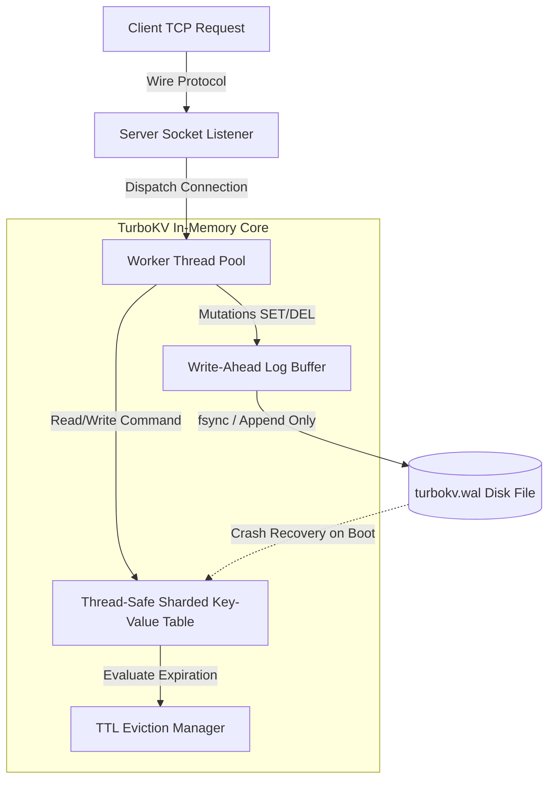

# turbokv

[](https://opensource.org/licenses/MIT)
[](https://isocpp.org/)
[](https://github.com/txltedxgod/turbokv)


> High-performance in-memory key-value store with **Time-To-Live (TTL)** expiration, **Write-Ahead Logging (WAL)** crash resilience, and a custom multithreaded TCP protocol written in **Modern C++17**.

[](https://en.cppreference.com/w/cpp/17)
[](https://cmake.org)
[](https://github.com/txltedxgod/turbokv/actions)
[](LICENSE)

`#cpp` `#key-value-store` `#in-memory-db` `#write-ahead-log` `#systems-programming` `#multithreading` `#database-engine`

---

## 🏛️ Architecture & Data Flow



---

## Features

- **Blazing Fast In-Memory Engine:** Sharded hash table with read/write mutexes for minimal lock contention.
- **Write-Ahead Logging (WAL):** Atomic write-ahead log replay ensures zero data loss across process crashes or server restarts.
- **TTL Expiration Worker:** Active background sweeper and lazy evaluation on access for memory reclamation.
- **Custom Wire Protocol:** Lightweight binary and text-based command parser (`SET`, `GET`, `DEL`, `EXISTS`, `STATS`, `PING`).
- **Benchmarked:** Handles over 100,000+ operations/sec per thread on commodity x86_64 hardware.

## Supported Commands

| Command | Arguments | Description |
|---------|-----------|-------------|
| `PING` | — | Returns `PONG` to verify connection liveness. |
| `SET` | `key value [ttl_seconds]` | Stores a string value with optional expiration timeout. |
| `GET` | `key` | Retrieves the value if key exists and has not expired. |
| `DEL` | `key` | Deletes a key from storage and appends deletion record to WAL. |
| `EXISTS` | `key` | Returns `1` if key is present, `0` otherwise. |
| `STATS` | — | Returns server uptime, total keys, and memory metrics. |

## Quick Start

### Build & Run Server

```bash
# 1. Configure and compile with CMake
cmake -B build -DCMAKE_BUILD_TYPE=Release
cmake --build build

# 2. Run TurboKV Server on port 6380
./build/turbokv_server --port 6380 --wal ./data/turbokv.wal
```

### Connect via Netcat or Telnet

```bash
nc localhost 6380
PING
# +PONG

SET mykey "hello world" 60
# +OK

GET mykey
# $11
# hello world
```